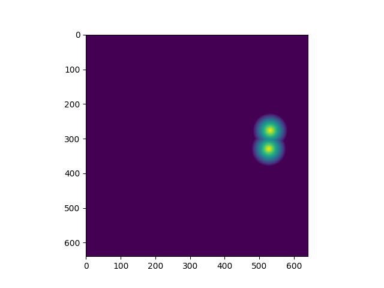
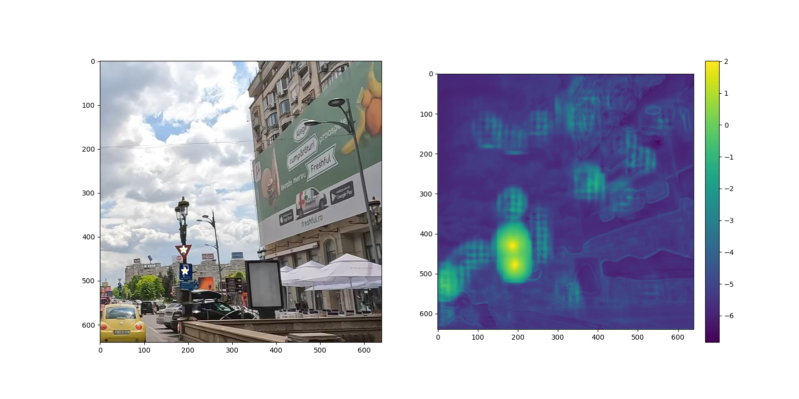

I'm working on a U-Net model adjusted to output keypoints in an image. Right now I'm training it on a [dataset of traffic signs from Kaggle](https://www.kaggle.com/datasets/raduoprea/traffic-signs). I hope to extend the model to 3D and use it to locate flagellar motors. There are anywhere from none to a dozen flagellar motors in the tomograms I work with, and I hope that a U-Net will capture the complexity of the problem and allow for an arbitrary number of output keypoints.

To summarize, the current pipeline is as follows:

- Convert the ground truth points that mark signs with "Gaussian"-looking masks (they're actually cones). Below is a training mask for a picture with two signs.

- Train a U-Net with only one output mask channel on the masks generated previously, with a logistic binary cross-entropy loss function. Thus the U-Net learns to output logits representing how far away the nearest sign is, with smaller logits implying that no sign is nearby, and large logits denoting a sign.

- Given the prediction masks that the model outputs, seek local maxima. We hope that these maxima are the locations of signs in the original image. An example from a recent iteration of the model is displayed below.

A few predictions from the validation set are in the `model_eval` directory, if you'd like to peek at how it's doing right now.

Next steps:
- Data augmentation, lots of it
- Hyperparameter optimization (or for some hyperparameters, just more intelligent ways of choosing would help. Many choices are arbitrary right now)
- Eventually, scale to 3D and train on tomograms

*** 

Although a YOLO model or a similar approach would undeniably be a better approach to solve the problem of detecting traffic signs in images, my focus on traffic signs serves a different purpose&mdash;as a surrogate problem for identifying flagellar motors and other structures in 3D tomograms. I suspect that the flexibility of the U-Net, the ease with which it can be adjusted to 3D images, and its ability (when used in this way) to output an arbitrary number of keypoints makes it a reasonable choice.
